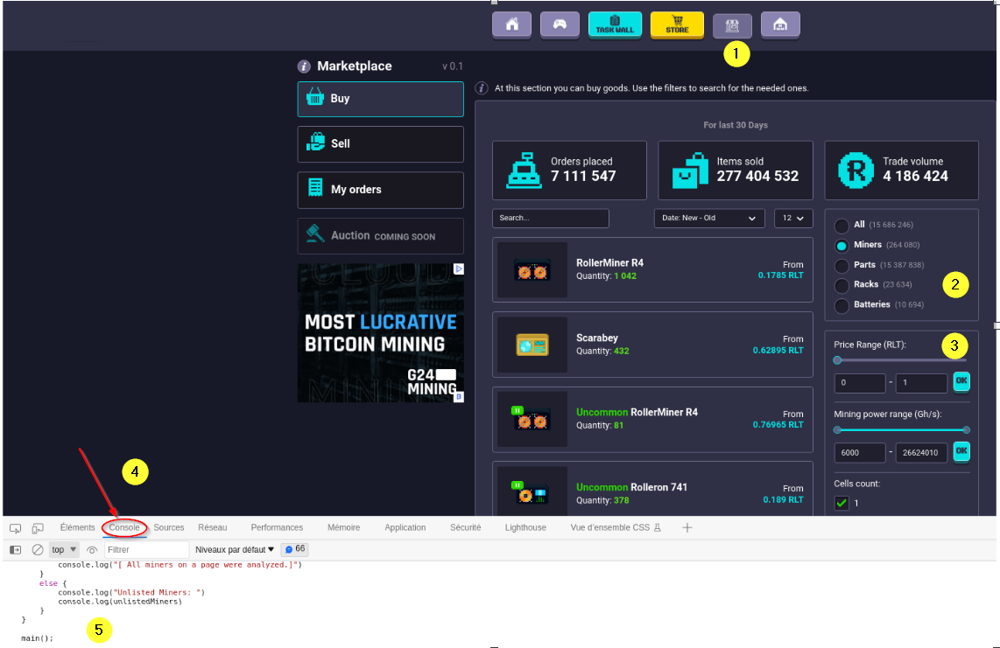
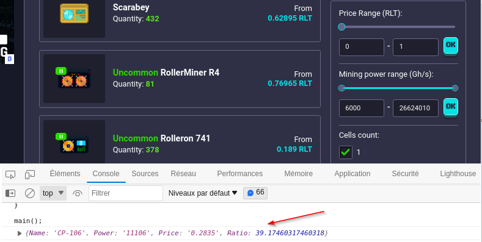

# Vanilla JavaScript browser console application for Rollercoin

## A JavaScript project of decision support for buying rollercoin miners

This project is intended to help rollercoin players decide which miner to buy 
according to the best **Power/Cost ratio**. 
Each miner has several characteristics:  

* Name
* Power
* Cost
* Bonus Power
* etc.

When inside the marketplace, some characteristics about the miners (name, price, available amount, etc.) are displayed.  
However, it is not possible to see the **Power** provided by the miner when on this page.  
This is not very practical and players are forced to click on a miner to see the power it provides.  
This project helps to select the miner that has the best **Power/Cost ratio**  
without clicking on each miner displayed on the page to compare their characteristics.

## How to use it

1. **Copy** the code from the **script.js** file.
1. **Open** your favorite internet browser. This project was tested on **Edge** and **Firefox**.
1. Log yourself into rollercoin.com and go to the marketplace.
1. (Optional) Use the filters feature on the right side of the page. It allow the script to be more efficient.
1. Press the **F12** key (It will open the developer tool of the browser).
1. Search for the **Console** tab.
1. Paste the clipboard content into the console.
1. Press **Enter** and voila.

## Demo

### Results

The list of miners available in the game is not comprehensive yet.
By consequence, data about some miners are not available and thus can not be processed.  

For that reason, there is a message at the end of the execution detailing the miners that has not been processed.  

## Find a bug or want to improve?

If you found an issue or would like to submit an improvement to this project,   
please submit an issue using the issue tab above.  
If you would like to submit PR with a fix, reference the issue you created.  

## Known issues (Work in progress)

This project is still ongoing, especially the part with completing the list of all miners available in the game.

## Referal program

If you want to join rollercoin.com, here is my referal link **https://rollercoin.com/?r=lfpqio8r**.  
By signing up with this link, you will receive 1000 free Satoshis.
