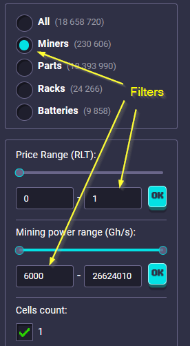
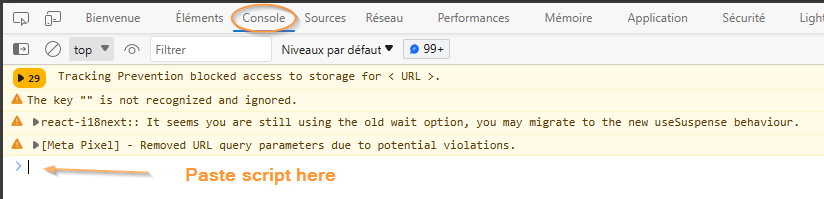
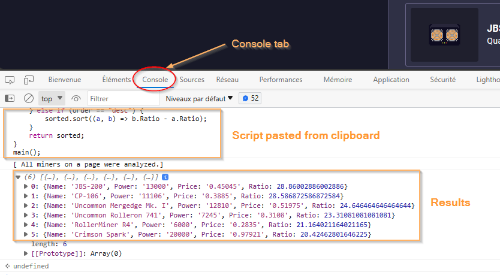

# Browser console tool for Rollercoin

## A project to help rollercoin players buy miners at optimal prices

This project is intended to help rollercoin players decide which miner to buy according to the best **Power/Cost ratio**.  

Each miner has several characteristics:  

* Name
* Power
* Cost
* Bonus Power
* etc.

When inside the marketplace, some characteristics about the miners (name, price, available amount, etc.) are displayed.  
However, it is not possible to see the **Power** provided by the miner when on this page.  
This is not very practical and players are forced to click on a miner to see the power it provides.  

This project helps to select the miner that has the best **Power/Cost ratio**  
without clicking on each miner displayed on the page to compare their characteristics.  
It does not require any installation and is executed inside the browser console.  

## How to use it

1. **Copy** the code from the **script.js** file.
2. **Open** your favorite internet browser.
3. Log yourself into rollercoin.com then go to the marketplace.

4. (Optional) Use the filters on the right side, it works better this way.

5. Press the **F12** key to open the browser developer tool.
6. For **Edge** users, it will ask you for a confirmation. Click on *Open DevTools*.
7. When DevTools is open, search for the **Console** tab.  
8. Paste the clipboard content into the console.

9. Press **Enter** and voila.  

## Results

The miners are sorted on the **ratio** property from the highest to the lowest.  
Each row represents a miner.  
The console displays **4 properties** for each miner:

* Name
* Power: The miner hash power in **Gh/s**. 
  The power is converted to **Ph/s** for calculation and readability purposes.  
  *Quick reminder :* **1000 Gh/s** is equivalent to **1 Th/s**.
* Price: The miner price in **RLT**.
* Ratio : The miner hash power in **Th/s** divided by the miner **cost**.

The **Ratio** property represents how much **RLT** does a **Th/s** costs.  

For instance, if we chose a miner in the list like the **JBS-200** at **0.45045 RLT** and with a hash power of **13 000 Gh/s**,  
the associated ratio is **28.8602**...  
This ratio means that for **1 RLT** spent, we got approximately **28.86 Th/s** of mining power.  

## Find a bug or want to improve?

If you found an issue or would like to submit an improvement to this project,   
please submit an issue using the issue tab above.  
If you would like to submit PR with a fix, reference the issue you created.  

## Known issues (Work in progress)

The list of miners available in the game used by this project is not comprehensive yet.  
By consequence, data about some miners are not available and thus can not be processed.  

For that reason, there is a message at the end of the execution detailing the miners that have not been processed.  

## Referral program

If you want to join rollercoin.com, here is my referral link **https://rollercoin.com/?r=lfpqio8r**.  
By signing up with this link, you will receive 1000 free Satoshis.